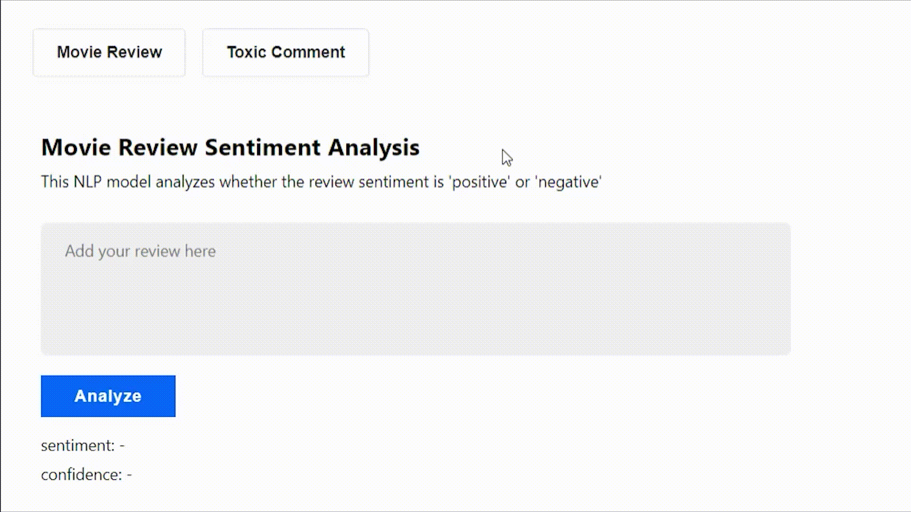

## Tech Stack

```
python          tensorflow      beautiful soup    sql
jupyter         keras           selenium          git
matplotlib      nltk            react             docker
seaborn         spacy           flask
scikit learn    hugging face    aws
```

<br>

## Web Application

🧰 [React Client](https://github.com/chickooooo/client)

`React` `JavaScript`

<br>

💾 [Flask Server](https://github.com/chickooooo/server)

`Flask` `Python` `Docker`

<br>



<br>
<br>

## Projects

#### Data Analysis

💊 [Heart Disease Analysis](https://github.com/chickooooo/heart_disease_analysis)

`EDA` `Visualizations`

<br>

📱 [Product Promotion A/B Testing](https://github.com/chickooooo/promotion_a_b_testing)

`A/B Testing` `3 Versions`

<br>
<br>

#### Machine Learning

🏃‍♂️ [Leaving Customer Prediction](https://github.com/chickooooo/leaving_customer)<br>

`Supervised ML` `Decision Tree`

<br>

🛒 [Customer Segmentation Clustering](https://github.com/chickooooo/customer_segmentation)

`Unsupervised ML` `K-means Clustering`

<br>
<br>

#### Deep Learning

✏️ [Handwritten Letter Recognition](https://github.com/chickooooo/handwritten_letter_recognition)

`ANN` `Image Recognition`

<br>
<br>

#### Natural Language Processing

🎬 [Movie Review Sentiment Analysis](https://github.com/chickooooo/movie_review_sentiment_analysis)

`Sentiment Analysis` `ROBERTa` `Hugging Face`

<br>

😩 [Spam Text Message Classification](https://github.com/chickooooo/spam_message_classification)

`Text Classification` `Logistic Regression`

<br>
<br>

#### Kaggle Competitions

🚀 [Spaceship Titanic](https://github.com/chickooooo/space_titanic_2)

`Binary Classification` `Soft Voting`

<br>

🏠 [California House Price Prediction](https://github.com/chickooooo/california_housing_2)

`Simple Regression` `Stacking`

<br>

🍷 [Wine Quality Ordinal Regression](https://github.com/chickooooo/wine_quality)

`Ordinal Regression` `Threshold Tuning`

<br>
<br>

#### Datasets

🦄 [Top Tech Startups Hiring 2023](https://github.com/chickooooo/top_tech_startups_hiring)

`CSV` `JSON` `Images`
